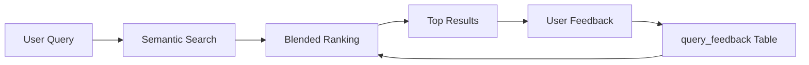

# Progressive Learning Roadmap for RAG System

This document outlines the implementation plan for Phases 2 and 3 of progressive learning capabilities in the RAG system. Phase 1 (basic feedback collection and adaptive ranking) has already been implemented.

## Current Implementation (Phase 1) ✅

### What's Already Working

1. **Feedback Collection System**
   - Database table: `query_feedback` (db/init/02_schema.sql:110-130)
   - API endpoint: `POST /feedback` (polars/app/service.py:79-130)
   - TUI integration: Ctrl+T (thumbs up) / Ctrl+D (thumbs down) (chat-tui/app.py:862-918)

2. **Adaptive Search Ranking**
   - Blended scoring algorithm:
     - 50% semantic similarity (cosine distance)
     - 30% reranker score (document relevance)
     - 20% user feedback score (aggregated helpfulness)
   - Implemented in: polars/app/service.py:286-315 (search) and 408-437 (answer)

3. **User Feedback Tracking**
   - Thumbs up/down on entire responses
   - Click tracking (implicit relevance signal)
   - Per-chunk feedback storage

### How It Works



**Data Flow:**
1. User asks a question
2. System embeds query and searches for similar chunks
3. Results are ranked using blended score (semantic + rerank + feedback)
4. User rates response with Ctrl+T or Ctrl+D
5. Feedback stored in database for all returned chunks
6. Future queries benefit from accumulated feedback

---

## Phase 2: Query History & Smart Reuse (1-2 Weeks) 🚧

### Overview
Build a query history system that learns from successful query-answer pairs and reuses them for similar future queries. This creates a "memory" of what worked well.

### Implementation Steps

#### 2.1 Add Query History Table

**File:** `db/init/03_query_history.sql` (new file)

```sql
-- ============================================
-- Query History Table for Smart Reuse
-- ============================================

CREATE TABLE IF NOT EXISTS query_history (
  id                BIGSERIAL PRIMARY KEY,
  query_text        TEXT NOT NULL,                -- Original user query
  query_embedding   VECTOR(768),                  -- Embedding of the query
  top_chunk_ids     BIGINT[],                     -- Array of chunk IDs returned
  answer_generated  TEXT,                         -- LLM's generated answer
  user_satisfaction REAL,                         -- 0.0 to 1.0 score (from feedback)
  model_used        TEXT,                         -- Model name used for generation
  retrieval_mode    TEXT,                         -- 'rag', 'hybrid', or 'chat'
  created_at        TIMESTAMPTZ DEFAULT NOW()
);

-- Index for vector similarity search on queries
CREATE INDEX IF NOT EXISTS idx_query_history_embedding
  ON query_history USING ivfflat (query_embedding vector_cosine_ops)
  WITH (lists = 100);

-- Index for finding high-quality answers
CREATE INDEX IF NOT EXISTS idx_query_history_satisfaction
  ON query_history (user_satisfaction DESC NULLS LAST);

-- Index for temporal analysis
CREATE INDEX IF NOT EXISTS idx_query_history_created
  ON query_history (created_at DESC);
```

#### 2.2 Modify Answer Endpoint to Store History

**File:** `polars/app/service.py`

Add after generating answer (around line 453):

```python
async def store_query_history(
    query: str,
    query_embedding: list[float],
    chunks: list[dict],
    answer: str,
    model: str,
    mode: str
):
    """Store successful query-answer pairs for future reuse."""
    try:
        with psycopg.connect(os.getenv("DATABASE_URL")) as conn:
            with conn.cursor() as cur:
                chunk_ids = [c["chunk_id"] for c in chunks]
                query_vector = to_pgvector(query_embedding)

                cur.execute("""
                    INSERT INTO query_history
                    (query_text, query_embedding, top_chunk_ids, answer_generated, model_used, retrieval_mode)
                    VALUES (%s, %s, %s, %s, %s, %s)
                    RETURNING id
                """, (query, query_vector, chunk_ids, answer, model, mode))

                history_id = cur.fetchone()[0]
                conn.commit()
                return history_id
    except Exception as e:
        # Don't fail the request if history storage fails
        print(f"Failed to store query history: {e}")
        return None

# Call this in the /answer endpoint after generating response
await store_query_history(
    query=query,
    query_embedding=query_embedding,
    chunks=chunks,
    answer=answer,
    model=model,
    mode=request.get("mode", "hybrid")
)
```

#### 2.3 Add Similar Query Search Endpoint

**File:** `polars/app/service.py`

```python
@app.get("/similar-queries")
async def find_similar_queries(q: str, k: int = 3, min_satisfaction: float = 0.7):
    """
    Find similar historical queries with high user satisfaction.

    Use this to check if a similar question was already answered well.
    If found, you can either:
    - Return the cached answer directly (fast)
    - Use it to inform the current search (hybrid approach)

    Args:
        q: Current user query
        k: Number of similar queries to find
        min_satisfaction: Minimum satisfaction score (0.7 = 70% helpful)

    Returns:
        List of similar historical queries with their answers and satisfaction scores
    """
    # Embed the query
    ollama_host = os.getenv("OLLAMA_HOST")
    embed_model = os.getenv("EMBED_MODEL")

    async with httpx.AsyncClient(timeout=30.0) as client:
        embed_resp = await client.post(
            f"{ollama_host}/api/embed",
            json={"model": embed_model, "input": [q]}
        )
        embed_resp.raise_for_status()
        query_embedding = embed_resp.json()["embeddings"][0]
        query_vector = to_pgvector(query_embedding)

    # Search for similar historical queries
    with psycopg.connect(os.getenv("DATABASE_URL")) as conn:
        with conn.cursor() as cur:
            cur.execute("""
                SELECT
                    query_text,
                    answer_generated,
                    user_satisfaction,
                    top_chunk_ids,
                    model_used,
                    retrieval_mode,
                    created_at,
                    query_embedding <=> %s::vector AS similarity
                FROM query_history
                WHERE user_satisfaction >= %s
                  AND query_embedding IS NOT NULL
                ORDER BY similarity
                LIMIT %s
            """, (query_vector, min_satisfaction, k))

            results = []
            for row in cur.fetchall():
                results.append({
                    "query": row[0],
                    "answer": row[1],
                    "satisfaction": float(row[2]) if row[2] else None,
                    "chunk_ids": row[3],
                    "model": row[4],
                    "mode": row[5],
                    "created_at": row[6].isoformat(),
                    "similarity": float(row[7])
                })

            return {"query": q, "similar_queries": results}
```

#### 2.4 Update Feedback Endpoint to Track Satisfaction

**File:** `polars/app/service.py`

Add a satisfaction update function:

```python
@app.post("/feedback/satisfaction")
async def update_query_satisfaction(request: dict):
    """
    Update user satisfaction score for a historical query.

    This should be called after the user provides thumbs up/down feedback
    to update the overall quality score of that query-answer pair.

    Args:
        request: Dict with query_text and satisfaction score (0.0-1.0)
    """
    query_text = request.get("query_text")
    satisfaction = request.get("satisfaction")  # 1.0 for thumbs up, 0.0 for thumbs down

    with psycopg.connect(os.getenv("DATABASE_URL")) as conn:
        with conn.cursor() as cur:
            # Calculate satisfaction based on chunk feedback
            cur.execute("""
                UPDATE query_history qh
                SET user_satisfaction = (
                    SELECT AVG(CASE WHEN was_helpful THEN 1.0 ELSE 0.0 END)
                    FROM query_feedback qf
                    WHERE qf.query_text = qh.query_text
                      AND qf.was_helpful IS NOT NULL
                )
                WHERE query_text = %s
                RETURNING user_satisfaction
            """, (query_text,))

            result = cur.fetchone()
            conn.commit()

            if result:
                return {
                    "status": "updated",
                    "query": query_text,
                    "satisfaction": float(result[0]) if result[0] else None
                }
            else:
                return {"error": "Query not found in history"}
```

#### 2.5 Enhance Chat TUI with Smart Suggestions

**File:** `chat-tui/app.py`

Add before sending query to LLM (around line 660):

```python
# Check for similar historical queries
try:
    similar_resp = await self.client.get(
        f"{POLARS_API}/similar-queries",
        params={"q": user_msg, "k": 1, "min_satisfaction": 0.8}
    )
    if similar_resp.status_code == 200:
        similar_data = similar_resp.json()
        similar_queries = similar_data.get("similar_queries", [])

        if similar_queries and similar_queries[0]["similarity"] < 0.1:  # Very similar
            best_match = similar_queries[0]
            chat_log.write(Panel(
                f"💡 Found a very similar question asked before:\n\n"
                f"**Previous question:** {best_match['query']}\n"
                f"**Satisfaction:** {best_match['satisfaction']*100:.0f}%\n"
                f"**When:** {best_match['created_at']}\n\n"
                f"Would you like to see that answer instead? (Currently continuing with new search)",
                title="[bold #e5c890]📚 Smart History[/bold #e5c890]",
                border_style="#e5c890"
            ))
except Exception as e:
    # Don't fail if history check fails
    pass
```

### Expected Benefits

- **Faster responses** for common questions (cached answers)
- **Consistency** in answers to similar queries
- **Quality improvement** over time (only high-satisfaction answers reused)
- **Training data** collection for Phase 3 fine-tuning

### Metrics to Track

```python
# Add to service.py for monitoring
@app.get("/metrics/learning")
def learning_metrics():
    """Get progressive learning metrics."""
    with psycopg.connect(os.getenv("DATABASE_URL")) as conn:
        with conn.cursor() as cur:
            # Query history stats
            cur.execute("""
                SELECT
                    COUNT(*) as total_queries,
                    COUNT(*) FILTER (WHERE user_satisfaction >= 0.7) as high_quality,
                    AVG(user_satisfaction) as avg_satisfaction
                FROM query_history
                WHERE created_at > NOW() - INTERVAL '7 days'
            """)
            history_stats = cur.fetchone()

            # Feedback stats
            cur.execute("""
                SELECT
                    COUNT(*) as total_feedback,
                    COUNT(*) FILTER (WHERE was_helpful = true) as positive,
                    COUNT(*) FILTER (WHERE was_helpful = false) as negative
                FROM query_feedback
                WHERE created_at > NOW() - INTERVAL '7 days'
            """)
            feedback_stats = cur.fetchone()

            return {
                "history": {
                    "total_queries": history_stats[0],
                    "high_quality_queries": history_stats[1],
                    "avg_satisfaction": float(history_stats[2]) if history_stats[2] else None
                },
                "feedback": {
                    "total": feedback_stats[0],
                    "positive": feedback_stats[1],
                    "negative": feedback_stats[2],
                    "positive_rate": feedback_stats[1] / feedback_stats[0] if feedback_stats[0] > 0 else 0
                }
            }
```

---

## Phase 3: Synthetic Query Generation & Model Fine-Tuning (Long-term) 🔮

### Overview
Use collected feedback to generate synthetic training data and fine-tune the embedding model. This is the most advanced phase and provides the biggest long-term improvements.

### Prerequisites

- **Minimum 1000+ feedback samples** collected
- **High-quality positive and negative examples** (from Phase 1 & 2)
- **GPU resources** for fine-tuning (or use cloud services)
- **sentence-transformers library** installed

### Implementation Steps

#### 3.1 Synthetic Query Generation Worker

**File:** `polars/app/synthetic_query_worker.py` (new file)

```python
"""
Synthetic Query Generation Worker

This worker generates diverse synthetic queries for each chunk based on
user feedback and document context. These queries represent different ways
users might ask about the same information.

Benefits:
- Expands training dataset beyond actual user queries
- Covers edge cases and variations
- Improves embedding model's ability to match diverse phrasings
"""

import os
import asyncio
import psycopg
from psycopg_pool import ConnectionPool
import httpx
import time

DB_URL = os.getenv("DATABASE_URL")
OLLAMA = os.getenv("OLLAMA_HOST", "http://192.168.7.215:11434")
CHAT_MODEL = os.getenv("CHAT_MODEL", "llama3.2")
BATCH_SIZE = int(os.getenv("SYNTH_BATCH", "10"))
SLEEP_SEC = int(os.getenv("SYNTH_SLEEP", "60"))

# Create synthetic queries table
SCHEMA = """
CREATE TABLE IF NOT EXISTS synthetic_queries (
  id            BIGSERIAL PRIMARY KEY,
  chunk_id      BIGINT REFERENCES chunks(id) ON DELETE CASCADE,
  generated_query TEXT NOT NULL,
  confidence    REAL DEFAULT 0.5,
  created_at    TIMESTAMPTZ DEFAULT NOW()
);

CREATE INDEX IF NOT EXISTS idx_synthetic_chunk
  ON synthetic_queries(chunk_id);
"""

async def generate_queries_for_chunk(chunk_id: int, chunk_text: str, document_title: str) -> list[str]:
    """
    Generate 5 diverse questions that this chunk would answer well.

    Uses LLM to create varied phrasings of how users might ask about this content.
    """
    prompt = f"""You are a helpful assistant that generates diverse search queries.

Document: {document_title}
Content: {chunk_text}

Generate 5 diverse questions that would be best answered by the content above.
Each question should:
- Be phrased differently (formal, casual, technical, simple, etc.)
- Focus on different aspects of the content
- Be realistic questions a user might actually ask

Output ONLY the questions, one per line, without numbers or bullets."""

    async with httpx.AsyncClient(timeout=60.0) as client:
        resp = await client.post(
            f"{OLLAMA}/api/generate",
            json={
                "model": CHAT_MODEL,
                "prompt": prompt,
                "stream": False
            }
        )
        resp.raise_for_status()
        data = resp.json()
        response_text = data.get("response", "")

        # Parse questions (one per line)
        queries = [q.strip() for q in response_text.split("\n") if q.strip()]
        return queries[:5]  # Limit to 5

async def worker_loop():
    """Main worker loop that generates synthetic queries for chunks."""
    pool = ConnectionPool(DB_URL, min_size=1, max_size=2, timeout=30)

    # Create table if needed
    with pool.connection() as conn:
        conn.execute(SCHEMA)
        conn.commit()

    print("Synthetic query generation worker started")
    iteration = 0

    while True:
        iteration += 1
        print(f"\n[Iteration {iteration}] Looking for chunks needing synthetic queries...")

        try:
            # Find chunks with positive feedback but no synthetic queries yet
            with pool.connection() as conn:
                with conn.cursor() as cur:
                    cur.execute("""
                        SELECT DISTINCT
                            c.id,
                            c.text,
                            d.title
                        FROM chunks c
                        JOIN documents d ON d.id = c.document_id
                        JOIN query_feedback qf ON qf.chunk_id = c.id
                        LEFT JOIN synthetic_queries sq ON sq.chunk_id = c.id
                        WHERE qf.was_helpful = true
                          AND sq.id IS NULL
                        LIMIT %s
                    """, (BATCH_SIZE,))

                    chunks = cur.fetchall()

            if not chunks:
                print("No chunks need synthetic queries. Sleeping...")
                await asyncio.sleep(SLEEP_SEC)
                continue

            print(f"Generating synthetic queries for {len(chunks)} chunks...")

            for chunk_id, chunk_text, doc_title in chunks:
                try:
                    queries = await generate_queries_for_chunk(chunk_id, chunk_text, doc_title)

                    # Store generated queries
                    with pool.connection() as conn:
                        with conn.cursor() as cur:
                            for query in queries:
                                cur.execute("""
                                    INSERT INTO synthetic_queries (chunk_id, generated_query, confidence)
                                    VALUES (%s, %s, 0.8)
                                """, (chunk_id, query))
                        conn.commit()

                    print(f"  ✓ Chunk {chunk_id}: Generated {len(queries)} queries")

                except Exception as e:
                    print(f"  ✗ Chunk {chunk_id}: Error - {e}")
                    continue

            print(f"Completed batch. Sleeping {SLEEP_SEC}s...")
            await asyncio.sleep(SLEEP_SEC)

        except Exception as e:
            print(f"Worker error: {e}")
            await asyncio.sleep(SLEEP_SEC)

if __name__ == "__main__":
    asyncio.run(worker_loop())
```

#### 3.2 Training Data Export Script

**File:** `polars/app/export_training_data.py` (new file)

```python
"""
Export Training Data for Embedding Model Fine-Tuning

This script exports training triplets in the format needed for fine-tuning
sentence-transformer models:
- (query, positive_chunk, negative_chunk)

Positive chunks: High user satisfaction + helpful feedback
Negative chunks: Same query but marked as not helpful (hard negatives)
"""

import psycopg
import json
import os
from pathlib import Path

DB_URL = os.getenv("DATABASE_URL")
OUTPUT_DIR = Path("/data/training")

def export_triplets():
    """
    Export training triplets for contrastive learning.

    Format: JSONL with {query, positive, negative} per line
    """
    OUTPUT_DIR.mkdir(parents=True, exist_ok=True)
    output_file = OUTPUT_DIR / "embedding_training_triplets.jsonl"

    with psycopg.connect(DB_URL) as conn:
        with conn.cursor() as cur:
            # Get triplets from actual user feedback
            cur.execute("""
                SELECT
                    qf_pos.query_text,
                    c_pos.text as positive_text,
                    c_neg.text as negative_text
                FROM query_feedback qf_pos
                JOIN chunks c_pos ON c_pos.id = qf_pos.chunk_id
                JOIN LATERAL (
                    SELECT c.text
                    FROM query_feedback qf_neg
                    JOIN chunks c ON c.id = qf_neg.chunk_id
                    WHERE qf_neg.query_text = qf_pos.query_text
                      AND qf_neg.was_helpful = false
                    LIMIT 1
                ) c_neg ON true
                WHERE qf_pos.was_helpful = true
            """)

            user_triplets = cur.fetchall()

            # Get triplets from synthetic queries
            cur.execute("""
                SELECT
                    sq.generated_query,
                    c_pos.text as positive_text,
                    c_neg.text as negative_text
                FROM synthetic_queries sq
                JOIN chunks c_pos ON c_pos.id = sq.chunk_id
                JOIN LATERAL (
                    SELECT c.text
                    FROM chunks c
                    WHERE c.id != sq.chunk_id
                      AND c.document_id != c_pos.document_id
                    ORDER BY RANDOM()
                    LIMIT 1
                ) c_neg ON true
                WHERE sq.confidence >= 0.7
            """)

            synthetic_triplets = cur.fetchall()

    # Combine and export
    all_triplets = user_triplets + synthetic_triplets

    with open(output_file, "w") as f:
        for query, positive, negative in all_triplets:
            triplet = {
                "query": query,
                "positive": positive,
                "negative": negative
            }
            f.write(json.dumps(triplet) + "\n")

    print(f"Exported {len(all_triplets)} triplets to {output_file}")
    print(f"  - User feedback: {len(user_triplets)}")
    print(f"  - Synthetic: {len(synthetic_triplets)}")

    return output_file

def export_pairs():
    """
    Export simple query-chunk pairs for simpler training approaches.

    Format: JSONL with {query, chunk, label} per line
    """
    output_file = OUTPUT_DIR / "embedding_training_pairs.jsonl"

    with psycopg.connect(DB_URL) as conn:
        with conn.cursor() as cur:
            cur.execute("""
                SELECT
                    qf.query_text,
                    c.text,
                    CASE WHEN qf.was_helpful THEN 1 ELSE 0 END as label
                FROM query_feedback qf
                JOIN chunks c ON c.id = qf.chunk_id
                WHERE qf.was_helpful IS NOT NULL
            """)

            pairs = cur.fetchall()

    with open(output_file, "w") as f:
        for query, chunk, label in pairs:
            pair = {
                "query": query,
                "chunk": chunk,
                "label": label
            }
            f.write(json.dumps(pair) + "\n")

    print(f"Exported {len(pairs)} pairs to {output_file}")
    return output_file

if __name__ == "__main__":
    print("Exporting training data...")
    triplets_file = export_triplets()
    pairs_file = export_pairs()
    print(f"\nTraining data ready:")
    print(f"  Triplets: {triplets_file}")
    print(f"  Pairs: {pairs_file}")
```

#### 3.3 Fine-Tuning Script

**File:** `scripts/finetune_embeddings.py` (new file)

```python
"""
Fine-Tune Embedding Model with Collected Feedback

This script fine-tunes a sentence-transformer model using the training
data collected from user feedback and synthetic queries.

Requirements:
  pip install sentence-transformers datasets torch

GPU recommended for reasonable training times.
"""

from sentence_transformers import SentenceTransformer, InputExample, losses
from sentence_transformers.evaluation import TripletEvaluator
from torch.utils.data import DataLoader
import json
from pathlib import Path

# Configuration
BASE_MODEL = "sentence-transformers/all-MiniLM-L6-v2"  # Or your current model
TRAINING_DATA = Path("/data/training/embedding_training_triplets.jsonl")
OUTPUT_MODEL = Path("/data/models/rag-finetuned-embedder")
BATCH_SIZE = 16
EPOCHS = 5
WARMUP_STEPS = 100

def load_triplets(filepath: Path) -> list[InputExample]:
    """Load training triplets from JSONL file."""
    examples = []

    with open(filepath, "r") as f:
        for line in f:
            data = json.loads(line)
            example = InputExample(
                texts=[data["query"], data["positive"], data["negative"]]
            )
            examples.append(example)

    return examples

def main():
    print(f"Loading base model: {BASE_MODEL}")
    model = SentenceTransformer(BASE_MODEL)

    print(f"Loading training data from: {TRAINING_DATA}")
    train_examples = load_triplets(TRAINING_DATA)
    print(f"Loaded {len(train_examples)} training triplets")

    # Create DataLoader
    train_dataloader = DataLoader(
        train_examples,
        shuffle=True,
        batch_size=BATCH_SIZE
    )

    # Use Triplet Loss for contrastive learning
    train_loss = losses.TripletLoss(model=model)

    print(f"Starting fine-tuning for {EPOCHS} epochs...")
    model.fit(
        train_objectives=[(train_dataloader, train_loss)],
        epochs=EPOCHS,
        warmup_steps=WARMUP_STEPS,
        output_path=str(OUTPUT_MODEL),
        show_progress_bar=True
    )

    print(f"Fine-tuning complete! Model saved to: {OUTPUT_MODEL}")
    print("\nTo use the fine-tuned model:")
    print("1. Copy the model files to your Ollama models directory")
    print("2. Update EMBED_MODEL environment variable")
    print("3. Restart embedder workers to re-embed existing chunks")

if __name__ == "__main__":
    main()
```

#### 3.4 Model Deployment & A/B Testing

Once fine-tuned:

1. **Deploy new model alongside existing one**
2. **Run A/B test**: 50% of queries use old model, 50% use new
3. **Compare metrics**:
   - User satisfaction scores
   - Feedback positive rate
   - Response relevance (manual sampling)
4. **Graduate winner** to 100% traffic

**Implementation:** Add to service.py

```python
import random

# In search endpoint, before embedding
USE_FINETUNED = os.getenv("USE_FINETUNED_MODEL", "false").lower() == "true"
AB_TEST_RATIO = float(os.getenv("AB_TEST_RATIO", "0.0"))  # 0.0 to 1.0

if USE_FINETUNED:
    # Full rollout of fine-tuned model
    embed_model = os.getenv("FINETUNED_EMBED_MODEL", "rag-finetuned-embedder")
elif random.random() < AB_TEST_RATIO:
    # A/B testing: some queries use new model
    embed_model = os.getenv("FINETUNED_EMBED_MODEL")
else:
    # Default model
    embed_model = os.getenv("EMBED_MODEL", "embeddinggemma")
```

### Expected Benefits

- **10-30% improvement** in retrieval accuracy
- **Better handling of paraphrases** and varied phrasings
- **Domain-specific understanding** (learns your document vocabulary)
- **Reduced reliance on exact keyword matching**

### Metrics to Track

```python
@app.get("/metrics/model-comparison")
def model_comparison():
    """Compare old vs new embedding model performance."""
    with psycopg.connect(os.getenv("DATABASE_URL")) as conn:
        with conn.cursor() as cur:
            # Get satisfaction scores by model version
            cur.execute("""
                SELECT
                    model_used,
                    COUNT(*) as total_queries,
                    AVG(user_satisfaction) as avg_satisfaction,
                    COUNT(*) FILTER (WHERE user_satisfaction >= 0.7) as high_quality
                FROM query_history
                WHERE created_at > NOW() - INTERVAL '7 days'
                GROUP BY model_used
            """)

            results = {}
            for row in cur.fetchall():
                results[row[0]] = {
                    "total_queries": row[1],
                    "avg_satisfaction": float(row[2]) if row[2] else None,
                    "high_quality_count": row[3]
                }

            return results
```

---

## Timeline Summary

| Phase | Duration | Complexity | Impact | Status |
|-------|----------|------------|--------|--------|
| **Phase 1: Basic Feedback** | 1 week | Low | Medium | ✅ **Implemented** |
| **Phase 2: Query History** | 1-2 weeks | Medium | High | 🚧 Ready to implement |
| **Phase 3: Model Fine-Tuning** | 2-4 weeks | High | Very High | 🔮 Future (after data collection) |

---

## Getting Started with Phase 2

When you're ready to implement Phase 2:

1. **Create the query history table:**
   ```bash
   docker compose exec polars-worker psql $DATABASE_URL -f /app/db/init/03_query_history.sql
   ```

2. **Update service.py** with the new endpoints (similar-queries, feedback/satisfaction)

3. **Modify answer endpoint** to store successful query-answer pairs

4. **Update chat TUI** to show smart suggestions

5. **Monitor metrics** at `/metrics/learning`

6. **Wait for 1000+ feedback samples** before moving to Phase 3

---

## Troubleshooting

### Low Feedback Collection Rate
- Make feedback more prominent in UI
- Add inline feedback buttons (not just keyboard shortcuts)
- Show user how their feedback helps

### Poor Query Similarity Matching
- Tune the `min_satisfaction` threshold
- Adjust similarity cutoff (currently 0.1)
- Add query preprocessing (lowercase, remove punctuation)

### Synthetic Queries Low Quality
- Use better prompt engineering
- Try different LLM models
- Add human review step for high-value chunks

### Fine-Tuning Not Improving Results
- Ensure training data is diverse (1000+ samples minimum)
- Check for data leakage (test set in training)
- Verify hard negatives are actually hard (not just random)
- Try different loss functions (MultipleNegativesRankingLoss, CosineSimilarityLoss)

---

## Further Reading

- [Sentence-Transformers Documentation](https://www.sbert.net/)
- [Contrastive Learning for Embeddings](https://arxiv.org/abs/2004.11362)
- [Hard Negative Mining Strategies](https://arxiv.org/abs/1907.11692)
- [pgvector Best Practices](https://github.com/pgvector/pgvector#best-practices)

---

**Questions?** Open an issue or discussion in the project repository.

**Last Updated:** 2025-10-31
